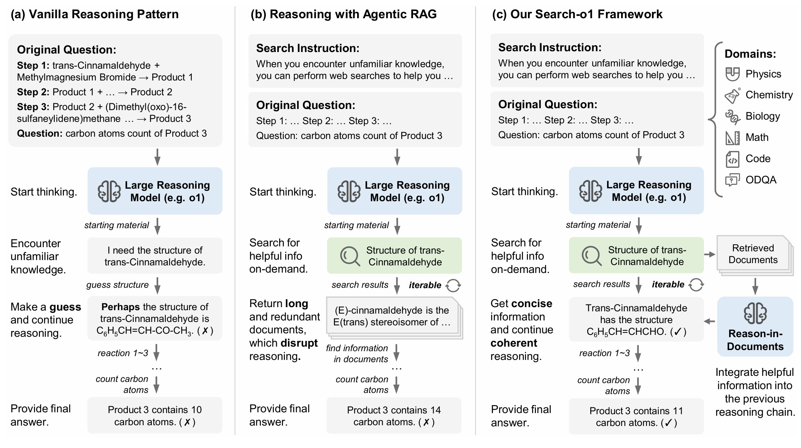

# <div align="center">🔍 Search-o1: Agentic Search-Enhanced</br> Large Reasoning Models</div>

<div align="center"> 

[](https://search-o1.github.io/) 
[](https://arxiv.org/abs/xxxx) 
[](https://opensource.org/licenses/MIT) 
[](https://www.python.org/downloads/release/python-390/) 

</div>

## ✨ Latest News
- **01/05/2025**: The homepage for Search-o1 is available. You can access it [here](https://search-o1.github.io/). Our paper is coming soon.
- **01/05/2025**: The code for Search-o1 has been released. You can now apply Search-o1 to enhance your large reasoning models.

## 💡 Overview

Large Reasoning Models (LRMs) like OpenAI's o1 have showcased remarkable stepwise reasoning capabilities through extensive reinforcement learning. Despite their strengths, these models often encounter knowledge insufficiencies during prolonged reasoning processes, resulting in frequent uncertainties and potential errors.


To overcome these challenges, we present **Search-o1**, a framework that augments LRMs with an **agentic Retrieval-Augmented Generation (RAG)** mechanism and a **Reason-in-Documents** module for deep analysis and integration of retrieved documents into the reasoning chain.
- **Agentic Search Workflow**: Integrates an agentic search process into the reasoning workflow, allowing models to dynamically retrieve external knowledge whenever they encounter uncertain information.
- **Reason-in-Documents Module**: Seamlessly integrates the retrieved information, reducing noise and maintaining coherent reasoning throughout.



This approach enhances the reliability and accuracy of LRMs, enabling them to handle complex reasoning tasks more effectively by addressing knowledge gaps in real-time.

## 🔧 Installation

### 1. Environment Setup
```bash
# Create conda environment
conda create -n search_o1 python=3.9
conda activate search_o1

# Install requirements
cd Search-o1
pip install -r requirements.txt
```

## 🏃 Quick Start

### Data Preparation

Use the code provided in `data/data_pre_process.ipynb` to preprocess each dataset into our standardized JSON format. The datasets we utilize are categorized into two types:

- **Challenging Reasoning Tasks:** 
    - **PhD-level Science QA:** GPQA
    - **Math Benchmarks:** MATH500, AMC2023, AIME2024
    - **Code Benchmark:** LiveCodeBench
- **Open-domain QA Tasks:**
    - **Single-hop QA:** NQ, TriviaQA
    - **Multi-hop QA:** HotpotQA, 2WikiMultihopQA, MuSiQue, Bamboogle

To preprocess the datasets, follow these steps:

1. Open the Jupyter notebook `data/data_pre_process.ipynb`.
2. For each dataset, run the corresponding preprocessing cells to convert the raw data into the unified JSON format.
3. The processed datasets will be saved in the `data/processed/` directory.

### Running Inference

You can run different inference modes using the provided scripts. Below are examples of how to execute each mode:

1. **Direct Reasoning (Standard Generation)**
    ```bash
    python scripts/run_direct_gen.py \
        --dataset_name gpqa \
        --split diamond \
        --model_path "YOUR_MODEL_PATH"
    ```

2. **Naive Retrieval-Augmented Generation (RAG)**
    ```bash
    python scripts/run_naive_rag.py \
        --dataset_name gpqa \
        --split diamond \
        --model_path "YOUR_MODEL_PATH" \
        --use_jina True \
        --jina_api_key "YOUR_JINA_API_KEY" \
        --bing_subscription_key "YOUR_BING_SUBSCRIPTION_KEY"
    ```

3. **RAG with Agentic Search**
    ```bash
    python scripts/run_rag_agent.py \
        --dataset_name gpqa \
        --split diamond \
        --max_search_limit 5 \
        --max_url_fetch 5 \
        --max_turn 10 \
        --top_k 10 \
        --use_jina True \
        --jina_api_key "YOUR_JINA_API_KEY" \
        --model_path "YOUR_MODEL_PATH" \
        --bing_subscription_key "YOUR_BING_SUBSCRIPTION_KEY"
    ```

4. **Search-o1 Enhanced Reasoning (Ours)**
    ```bash
    python scripts/run_search_o1.py \
        --dataset_name aime \
        --split test \
        --max_search_limit 5 \
        --max_turn 10 \
        --top_k 10 \
        --max_doc_len 3000 \
        --use_jina True \
        --jina_api_key "YOUR_JINA_API_KEY" \
        --model_path "YOUR_MODEL_PATH" \
        --bing_subscription_key "YOUR_BING_SUBSCRIPTION_KEY"
    ```

**Parameters Explanation:**
- `--dataset_name`: Name of the dataset to use (e.g., gpqa, aime).
- `--split`: Data split to run (e.g., train, test, diamond).
- `--model_path`: Path to the pre-trained LRM model.
- `--bing_subscription_key`: Your Bing Search API subscription key.
- `--max_search_limit`: Maximum number of search queries per reasoning session.
- `--max_url_fetch`: Maximum number of URLs to fetch per search.
- `--max_turn`: Maximum number of reasoning turns.
- `--top_k`: Number of top documents to retrieve.
- `--max_doc_len`: Maximum length of each retrieved document.
- `--use_jina`: Whether to use Jina for document processing.
- `--jina_api_key`: Your Jina API subscription key for URL content fetching.

Ensure you replace `"YOUR_MODEL_PATH"` with your actual model path, replace `"YOUR_BING_SUBSCRIPTION_KEY"` and `"YOUR_JINA_API_KEY"` with your Bing Search and Jina API key.

## 📊 Results

To evaluate the performance of Search-o1, compare it against standard RAG and direct reasoning approaches using the provided evaluation scripts. Refer to the `results/` directory for detailed performance metrics and analysis.

Refer to our paper for detailed experimental setups, benchmarks, and analysis.

## 📄 Citation

If you find this work helpful, please cite our paper:
```bibtex
@article{search-o1,
    title={Search-o1: Agentic Search-Enhanced Large Reasoning Models},
    author={Xiaoxi Li and
            Guanting Dong and
            Jiajie Jin and
            Yuyao Zhang and
            Peitian Zhang and
            Yujia Zhou and
            Yutao Zhu and
            Zhicheng Dou},
    journal={CoRR},
    volume={abs/xxxx.xxxxxx},
    year={2025},
    url={https://arxiv.org/abs/xxxx.xxxxxx},
    eprinttype={arXiv},
    eprint={xxxx.xxxxxx}
}
```

## 📄 License

This project is released under the [MIT License](LICENSE).

## 📞 Contact

For any questions or feedback, please reach out to us at [xiaoxi_li@ruc.edu.cn](xiaoxi_li@ruc.edu.cn).

---

© 2025 Search-o1 Team. All rights reserved.