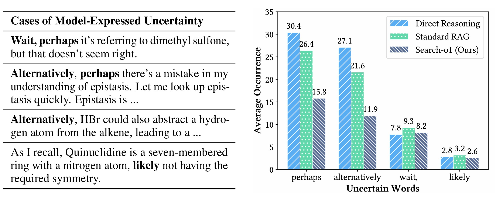
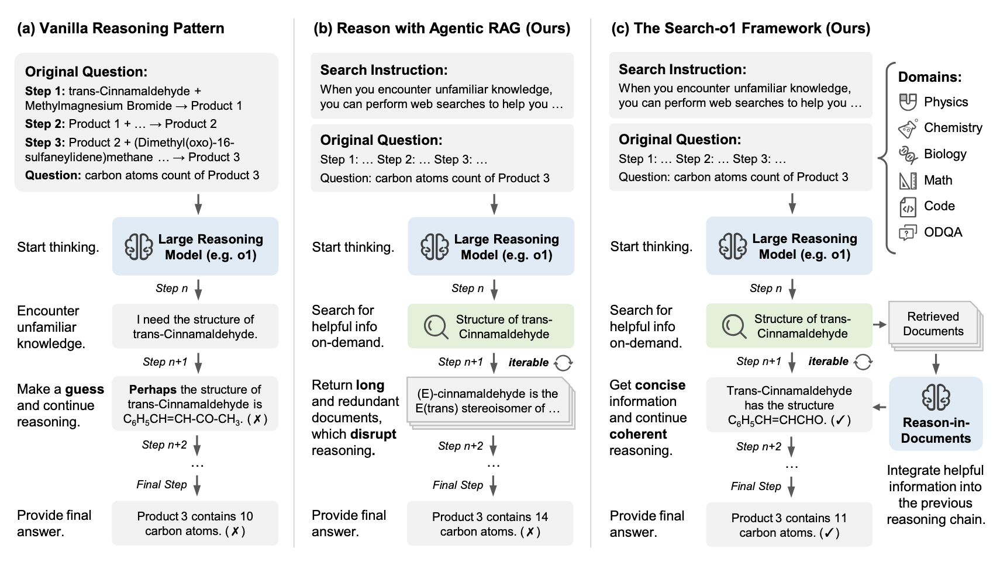
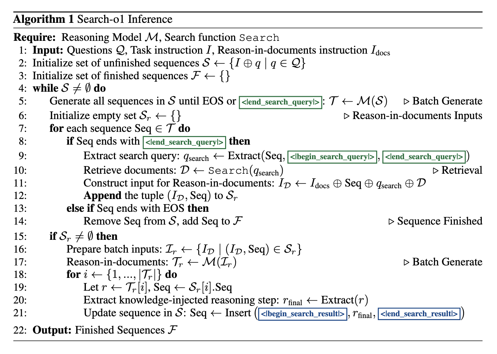

<h1 align="center"> 🔍 Search-o1: Agentic Search-Enhanced</br> Large Reasoning Models</a></h1>


<div align="center"> 

[](https://search-o1.github.io/) 
[](https://arxiv.org/abs/2501.05366) 
[](https://opensource.org/licenses/MIT) 
[](https://www.python.org/downloads/release/python-390/) 
[](https://x.com/_akhaliq/status/1877584951840764166?t=fnbTblnqhiPtAyYr1PHbbw&s=19)
</div>


<!-- <div align="center">
    <span style="display:inline-block; margin-right: 10px;">
        <a href="https://paperswithcode.com/sota/mathematical-reasoning-on-aime24?p=search-o1-agentic-search-enhanced-large">
            
        </a>
    </span>
    <span style="display:inline-block; margin-right: 10px;">
        <a href="https://paperswithcode.com/sota/mathematical-reasoning-on-amc23?p=search-o1-agentic-search-enhanced-large">
            
        </a>
    </span>
  <span style="display:inline-block; margin-right: 10px;">
        <a href="https://paperswithcode.com/sota/on-gpqa?p=search-o1-agentic-search-enhanced-large">
            
        </a>
    </span>
</div> -->


<h5 align="center"> If you like our project, please give us a star ⭐ on GitHub for the latest update.</h5>

## 📣 Latest News
- **03/31/2025**: 🎉 **Our new framework WebThinker is available**, which empowers reasoning models with **deep research** capability. You can access the [Github Repo](https://github.com/RUC-NLPIR/WebThinker) and the [Notion Page](https://foremost-beechnut-8ed.notion.site/WebThinker-Empowering-Large-Reasoning-Models-with-Deep-Research-Capability-d13158a27d924a4b9df7f9ab94066b64).
- **01/10/2025**: The brief introduction of our Search-o1 can be found on platforms like [X](https://x.com/_akhaliq/status/1877584951840764166?t=fnbTblnqhiPtAyYr1PHbbw&s=19), [Zhihu](https://zhuanlan.zhihu.com/p/17527068532), and [WeChat](https://mp.weixin.qq.com/s/J_n5cn_Zp4lRs8ESqFEFmg).
- **01/10/2025**: The paper for Search-o1 is available. You can access it on [arXiv](https://arxiv.org/abs/2501.05366), [alphaXiv](https://www.alphaxiv.org/abs/2501.05366) and [HF-paper](https://huggingface.co/papers/2501.05366).
- **01/06/2025**: The homepage for Search-o1 is available. You can access it [here](https://search-o1.github.io/).
- **01/05/2025**: The code for Search-o1 has been released. You can now apply Search-o1 to enhance your large reasoning models.

## ✏️ To Do List
- [ ] Add results of Search-o1 with different backbone reasoning models like [Sky-T1](https://novasky-ai.github.io/posts/sky-t1) and [DeepSeek-R1](https://github.com/deepseek-ai/DeepSeek-R1).
- [ ] Train the reasoning models to better utilize search tool.
- [ ] Add more tools (e.g., calculators, code interpreters, ...) to further improve the capabilities of reasoning models.

## 💡 Overview

Large Reasoning Models (LRMs) like OpenAI's o1 have showcased remarkable long stepwise reasoning capabilities through large-scale reinforcement learning. Despite their strengths, these models often encounter knowledge insufficiencies during prolonged reasoning processes, resulting in frequent uncertainties and potential errors, as shown in the following figure.

<p align="center">
  
</p>

### ✨ Method

To overcome these challenges, we present **Search-o1**, a framework that augments LRMs with an **agentic Retrieval-Augmented Generation (RAG)** mechanism and a **Reason-in-Documents** module for deep analysis and integration of retrieved documents into the reasoning chain.
- **Agentic Search Workflow**: Integrates an agentic search process into the reasoning workflow, allowing models itself to dynamically retrieve external knowledge whenever they encounter uncertain information.
- **Reason-in-Documents Module**: Seamlessly integrates the retrieved information, reducing noise and maintaining a coherent reasoning chain.




### ✨ Inference Process

Search-o1 incorporates a batch generation mechanism with interleaved search. We initialize reasoning sequences by combining task instructions with input questions. It simultaneously generates tokens for all sequences, detecting search queries to retrieve relevant documents in batches. These documents are then refined and seamlessly integrated back into the reasoning chains, iterating this process until all sequences are completed and final answers are produced.



This approach enhances the reliability and accuracy of LRMs, enabling them to handle complex reasoning tasks more effectively by addressing knowledge gaps in real-time.


## 🔧 Installation

### 1. Environment Setup
```bash
# Create conda environment
conda create -n search_o1 python=3.9
conda activate search_o1

# Install requirements
cd Search-o1
pip install -r requirements.txt
```

## 🏃 Quick Start

### Data Preparation

Use the code provided in `data/data_pre_process.ipynb` to preprocess each dataset into our standardized JSON format. The datasets we utilize are categorized into two types:

- **Challenging Reasoning Tasks:** 
    - **PhD-level Science QA:** GPQA
    - **Math Benchmarks:** MATH500, AMC2023, AIME2024
    - **Code Benchmark:** LiveCodeBench
- **Open-domain QA Tasks:**
    - **Single-hop QA:** NQ, TriviaQA
    - **Multi-hop QA:** HotpotQA, 2WikiMultihopQA, MuSiQue, Bamboogle

To preprocess the datasets, follow these steps:

1. Open the Jupyter notebook `data/data_pre_process.ipynb`.
2. For each dataset, run the corresponding preprocessing cells to convert the raw data into a unified JSON format.
3. The processed datasets will be saved in the `data/` directory.

If your task does not belong to any of the datasets mentioned above, for generation tasks such as QA, math, or code, etc., format the data as `{'Question': str, 'answer': str}`. For multi-choice tasks, format the data as `{'Question': str, 'Correct Choice': str}`. Additionally, modify `scripts/evaluate.py`, `scripts/prompts.py`, and `scripts/run_xxx_xxx.py` to match your task.

### Model Inference

You can run different inference modes using the provided scripts. Below are examples of how to execute each mode:

1. **Direct Reasoning (Direct Generation)**
```bash
python scripts/run_direct_gen.py \
    --dataset_name gpqa \
    --split diamond \
    --model_path "YOUR_MODEL_PATH"
```

2. **Naive Retrieval-Augmented Generation (RAG)**
```bash
python scripts/run_naive_rag.py \
    --dataset_name gpqa \
    --split diamond \
    --use_jina True \
    --model_path "YOUR_MODEL_PATH" \
    --jina_api_key "YOUR_JINA_API_KEY" \
    --bing_subscription_key "YOUR_BING_SUBSCRIPTION_KEY"
```

3. **RAG with Agentic Search**
```bash
python scripts/run_rag_agent.py \
    --dataset_name gpqa \
    --split diamond \
    --max_search_limit 5 \
    --max_url_fetch 5 \
    --max_turn 10 \
    --top_k 10 \
    --use_jina True \
    --model_path "YOUR_MODEL_PATH" \
    --jina_api_key "YOUR_JINA_API_KEY" \
    --bing_subscription_key "YOUR_BING_SUBSCRIPTION_KEY"
```

4. **Search-o1 (Ours)**
```bash
python scripts/run_search_o1.py \
    --dataset_name aime \
    --split test \
    --max_search_limit 5 \
    --max_turn 10 \
    --top_k 10 \
    --max_doc_len 3000 \
    --use_jina True \
    --model_path "YOUR_MODEL_PATH" \
    --jina_api_key "YOUR_JINA_API_KEY" \
    --bing_subscription_key "YOUR_BING_SUBSCRIPTION_KEY"
```

**Parameters Explanation:**
- `--dataset_name`: Name of the dataset to use (e.g., gpqa, aime).
- `--split`: Data split to run (e.g., train, test, diamond).
- `--model_path`: Path to the pre-trained LRM model.
- `--bing_subscription_key`: Your Bing Search API subscription key.
- `--max_search_limit`: Maximum number of search queries per reasoning session.
- `--max_url_fetch`: Maximum number of URLs to fetch per search.
- `--max_turn`: Maximum number of reasoning turns.
- `--top_k`: Number of top documents to retrieve.
- `--max_doc_len`: Maximum length of each retrieved document.
- `--use_jina`: Whether to use Jina for document processing.
- `--jina_api_key`: Your Jina API subscription key for URL content fetching.

Ensure you replace `"YOUR_MODEL_PATH"` with your actual model path, replace `"YOUR_BING_SUBSCRIPTION_KEY"` and `"YOUR_JINA_API_KEY"` with your Bing Search and Jina API key.

### Evaluation

Our model inference scripts will automatically save the model's input and output texts for evaluation. However, for methods with retrieval, since the model has not been trained to use the retrieved text effectively, it often fails to provide a final answer. We apply a backoff strategy to use the direct generation result when the retrieval-based methods do not provide a final answer for a given data point.

To use this backoff strategy, you need to provide the path to the direct generation results in the `scripts/evaluate.py` file, and then use the following command to get the backoff results for retrieval-based methods:

```bash
python scripts/evaluate.py \
    --output_path outputs/... \
    --apply_backoff
```


## 📄 Citation

If you find this work helpful, please cite our paper:
```bibtex
@article{Search-o1,
  author       = {Xiaoxi Li and
                  Guanting Dong and
                  Jiajie Jin and
                  Yuyao Zhang and
                  Yujia Zhou and
                  Yutao Zhu and
                  Peitian Zhang and
                  Zhicheng Dou},
  title        = {Search-o1: Agentic Search-Enhanced Large Reasoning Models},
  journal      = {CoRR},
  volume       = {abs/2501.05366},
  year         = {2025},
  url          = {https://doi.org/10.48550/arXiv.2501.05366},
  doi          = {10.48550/ARXIV.2501.05366},
  eprinttype    = {arXiv},
  eprint       = {2501.05366},
  timestamp    = {Wed, 19 Feb 2025 21:19:08 +0100},
  biburl       = {https://dblp.org/rec/journals/corr/abs-2501-05366.bib},
  bibsource    = {dblp computer science bibliography, https://dblp.org}
}
```

## 📄 License

This project is released under the [MIT License](LICENSE).

## 📞 Contact

For any questions or feedback, please reach out to us at [xiaoxi_li@ruc.edu.cn](xiaoxi_li@ruc.edu.cn).

## 🌟 Star History

[](https://star-history.com/#sunnynexus/Search-o1&Date)
